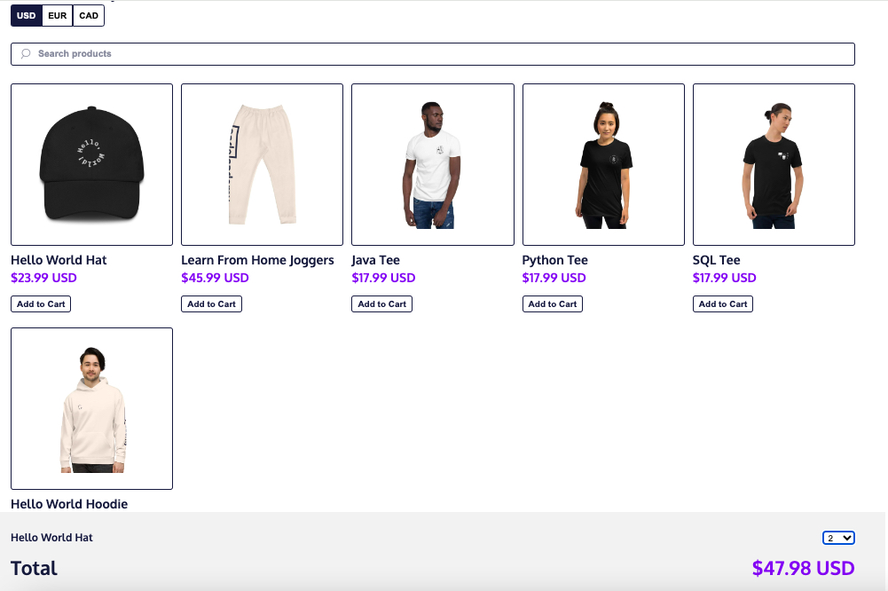

# Codecademy Store (Redux)

## Table of contents

- [Overview](#overview)
  - [The challenge](#the-challenge)
  - [Screenshot](#screenshot)
  - [Links](#links)
- [My process](#my-process)
  - [Built with](#built-with)
  - [What I learned](#what-i-learned)
  - [Continued development](#continued-development)
- [Author](#author)

## Overview

### The challenge

Users should be able to:

- View the optimal layout for the app depending on their device's screen size.
- See online shopping platform.
- Change currency setting.
- Search inventory list.
- Select items from inventory list to add to cart.
- Select quantity of item.

### Screenshot

### Links

- Live Site URL: [View](https://codecademystoreredux.netlify.app/)

## My process

- To build the Codecademy Store, you need to manage three slices of state: `inventory`, `cart`, and `currencyFilter`.
- Each slice handles different parts of the app: available products, items added to the cart, and the currency used for price display, respectively.
- The project starts by creating action creators for modifying the `cart` slice, such as adding items and changing their quantities.
- These actions are handled in the `cartReducer`, where the cart state is updated immutably.
- After implementing the cart logic, you combine all three slice reducers into a root reducer using Redux’s `combineReducers`.
- Then, create the Redux store by passing the root reducer into `createStore` and export the store for use in your React components.
- In `index.js`, the store is passed down to the top-level `<App />` component as props, specifically `state` and `dispatch`.
- To ensure components reflect state updates, you subscribe the render function to store changes.
- Next, in `App.js`, the `<Cart />` component is rendered alongside other components like `<Inventory />`, each receiving the necessary state slices and dispatch method as props.
- Within `Cart.js`, you render a list of cart items using the `createCartItem()` function and calculate the cart total by calling the provided `calculateTotal()` function.
- When the user updates the item quantity, an action is dispatched to modify the cart state accordingly.
- Finally, you can add extra features like a search filter to enhance the product display experience.

### Built with

- Semantic HTML5 markup
- CSS custom properties
- Mobile-Responsive Design
- JavaScript - Scripting language
- [React](https://reactjs.org/) - JS library
- [Redux](https://redux.js.org/) - JS library

### What I learned

This was a class project to implement the Core Redux API.

### Continued development

maybe use later

## Author

- Website - [Cameron Howze](https://camkol.github.io/)
- Frontend Mentor - [@camkol](https://www.frontendmentor.io/profile/camkol)
- GitHub- [@camkol](https://github.com/camkol)
- LinkedIn - [@cameron-howze](https://www.linkedin.com/in/cameron-howze-28a646109/)
- E-Mail - [cameronhowze4@outlook.com](mailto:cameronhowze4@outlook.com)
